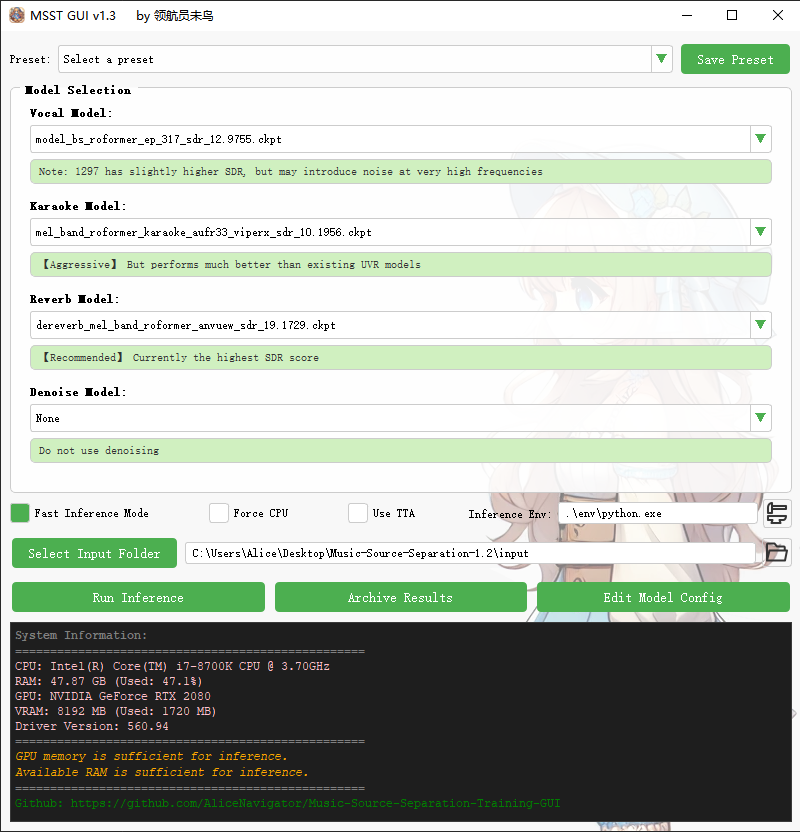
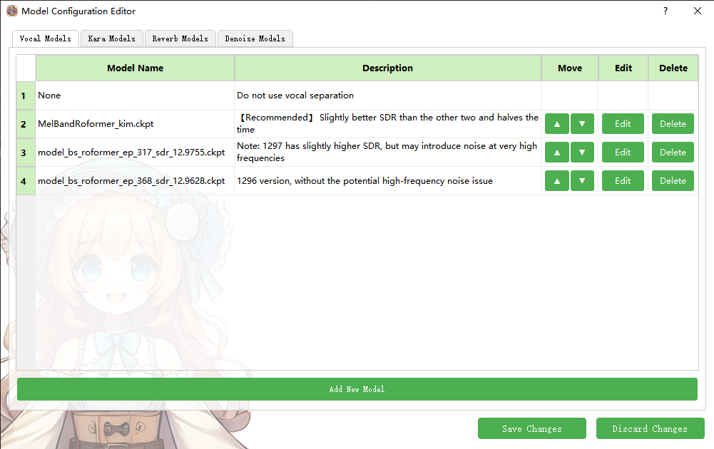

## Introduction

MSST-GUI is a Qt5-based inference GUI, designed to provide a convenient and intuitive way to inference (mainly for my own use). At its core, it's a GUI that uses a specified Python environment to add parameters and call `inference.py`. As such, you can also package `msst_gui_en.py` as a smaller executable file and use it in the main repository.




Inferences are executed sequentially on the target audio from top to bottom. For example, enabling Vocal Model, Karaoke Model, and Reverb Model for a song will directly yield the dry main vocal. Hover your mouse over the corresponding areas to see explanatory information.



MSST-GUI also comes equipped with a configuration editor, allowing you to add and use your own models or edit existing ones. Models should be placed in the `pretrain` directory.

## Installation

1. Clone this repository:
   ```
   git clone https://github.com/yourusername/MSST-GUI.git
   ```
2. Install the required dependencies:
   ```
   pip install -r requirements-gui-only.txt
   ```

## Usage

For English users:
```
python msst_gui_en.py
```

For Chinese users:
```
python msst_gui_zh.py
```


